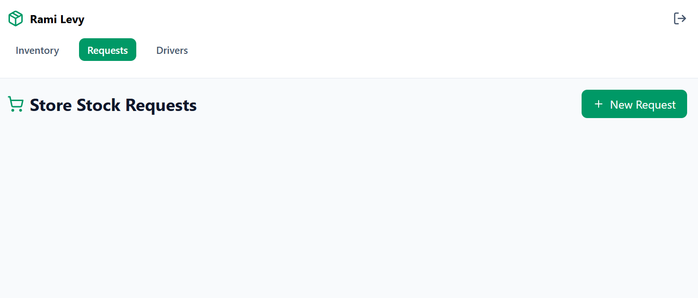
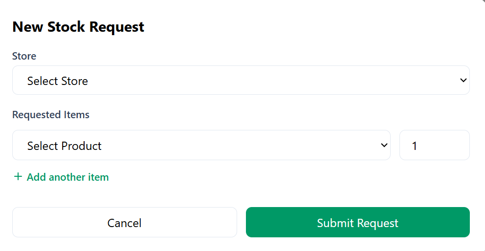
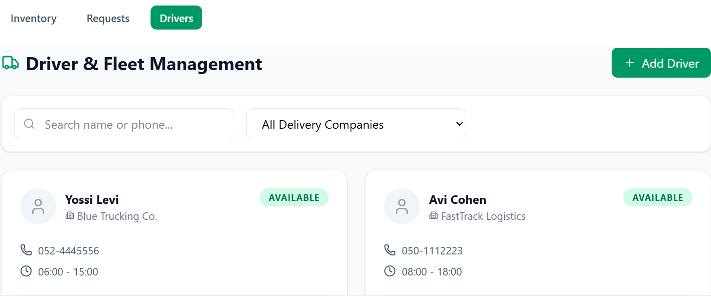

# Logistics & Inventory Management System (Rami Levy)

Project by **Sara Heymann 2254681 and Sarah Sebaoun 345887582**

## Table of Contents
- [Phase 1: Design and Build the Database](#phase-1-design-and-build-the-database)
  - [Introduction](#introduction)
  - [ERD (Entity-Relationship Diagram)](#erd-entity-relationship-diagram)
  - [DSD (Data Structure Diagram)](#dsd-data-structure-diagram)
  - [SQL Scripts](#sql-scripts)
  - [Data Population Methods](#data-population-methods)
  - [Backup & Restore](#backup--restore)
- [Phase 2: Queries and Constraints](#phase-2-queries-and-constraints)
  - [Introduction](#phase-2-introduction)
  - [1. SELECT Queries](#1-select-queries)
  - [2. COMMIT & ROLLBACK](#2-commit--rollback)
  - [3. UPDATE Queries](#3-update-queries)
  - [4. DELETE Queries](#4-delete-queries)
  - [5. Constraints (ALTER TABLE)](#5-constraints-alter-table)
  - [6. Indexes](#6-indexes)
  - [7. Backup](#7-backup-1)

---

## Phase 1: Design and Build the Database

### Introduction
The **Logistics Management System** is designed to efficiently manage the complex supply chain of a retail giant like **Rami Levy**. It tracks the journey of products from large-scale warehouses to individual store shelves through a coordinated transportation network.

#### Purpose of the System
- **Inventory Tracking**: Real-time monitoring of stock across different warehouse locations.
- **Store Orders**: Handling automated and manual product requests from stores.
- **Logistics & Fleet**: Managing trucks, driver schedules, and working hours.
- **Regional Distribution**: Connecting delivery companies to specific geographical sectors.

#### UI Prototypes (Google AI Studio)
*To visualize the system's interface, we generated various prototype pages using Google AI Studio:*

| Dashboard Overview | Inventory Management | Order Tracking | Delivery Schedule |
| :---: | :---: | :---: | :---: |
|  |  |  |  |

### ERD (Entity-Relationship Diagram)
The ERD illustrates the logical architecture of the database, showing how Stores, Warehouses, and Trucks interact.


### DSD (Data Structure Diagram)
The DSD details the physical schema, including primary/foreign keys and field constraints.


### SQL Scripts
- 📜 **[Create Tables](Stage%201/createTables.sql)**: Schema definition.
- 📜 **[Drop Tables](Stage%201/dropTables.sql)**: Table cleanup script.
- 📜 **[Select All](Stage%201/selectAll.sql)**: Data verification queries.

---

### Data Population Methods
We utilized three distinct strategies to populate the database with over 2,000 rows of realistic data:

#### 1. Manual CSV Import
Static reference data, such as warehouse locations and fixed regional codes, were imported via standard CSV files.
- 📂 **[Data Import Files](Stage%201/DataImportFiles/)**

#### 2. Automated Python Generation
For dynamic entities requiring specific logic (like unique store IDs or formatted phone numbers starting with "02"), we used Python scripts. This allowed for the generation of 300+ unique stores with professional naming conventions.
- 🐍 **Script:** `Stage 1/Programing/generator.py`

#### 3. Mockaroo (Synthetic Data)
To simulate a high volume of transactions and products, we used [Mockaroo](https://www.mockaroo.com/). This was essential for populating the `PRODUCT` and `CONTAINS` tables with valid dates and price ranges.


---

### Backup & Restore
Data safety is guaranteed through a complete SQL dump of the database.
- 💾 **[Database Backup File](databaseBackup.sql)**

We successfully performed a database restore to verify data persistence. The image below confirms the `contains` table was fully recovered in the pgAdmin environment:


---

## Phase 2: Queries and Constraints

### Phase 2 Introduction
In this phase, we query the database to extract meaningful insights and enforce business rules through constraints and indexes. 

All SQL query files for this phase can be found in the designated code directory: [Queries Folder](Stage%202/Queries/).

---

### 1. SELECT Queries

#### Double Versions (Comparing Efficiency: A vs B)

**Query 1: Products Below Minimum Stock**
- **Description:** Provide a global report of all products currently below their minimum stock threshold across all company warehouses.

**Version A (Multiple JOINs):** 
```sql
-- This scans all warehouses and links products to their current stock status.
SELECT 
    w.WarehouseID, 
    w.Region AS WarehouseName, 
    p.ProductName, 
    i.Quantity, 
    i.MinimumStock
FROM PRODUCT p
JOIN INVENTORY i ON p.ProductID = i.ProductID
JOIN LOCATED l ON p.ProductID = l.ProductID
JOIN WAREHOUSE w ON l.WarehouseID = w.WarehouseID
WHERE i.Quantity < i.MinimumStock
ORDER BY w.WarehouseID, p.ProductName; -- Organized by warehouse for clarity
```

**Version B (Subqueries):**
```sql
-- This calculates stock and warehouse names for each product individually.
SELECT 
    l.WarehouseID,
    (SELECT Region FROM WAREHOUSE WHERE WarehouseID = l.WarehouseID) AS WarehouseName,
    p.ProductName,
    (SELECT Quantity FROM INVENTORY WHERE ProductID = p.ProductID) AS Qty,
    (SELECT MinimumStock FROM INVENTORY WHERE ProductID = p.ProductID) AS MinStock
FROM PRODUCT p
JOIN LOCATED l ON p.ProductID = l.ProductID
WHERE p.ProductID IN (
      SELECT ProductID FROM INVENTORY WHERE Quantity < MinimumStock
)
ORDER BY l.WarehouseID;
```
**Comparison (Why Version A is better):** Version A uses standard JOINs to build a single result set, allowing the database engine to utilize indexes efficiently in one pass. Version B relies on multiple correlated subqueries in the SELECT clause, forcing a repetitive row-by-row lookup. This makes Version A significantly more efficient and the professional choice.

**Execution & Result:**  


**Query 2: Delivery Performance by Company**
- **Description:** Analyzes the delivery performance and financial volume handled by different delivery companies within the current month.

**Version A (Direct Grouping):**
```sql
-- Direct grouping after join
SELECT dc.DeliveryCieName, COUNT(o.OrderId) as TotalOrders, SUM(o.Price) as TotalValue
FROM DELIVERYCOMPAGNY dc
JOIN TRUCK t ON dc.DeliveryCieID = t.DeliveryCieID
JOIN "ORDER" o ON t.DriverID = o.DriverID
WHERE EXTRACT(MONTH FROM o.OrderDate) = EXTRACT(MONTH FROM CURRENT_DATE)
GROUP BY dc.DeliveryCieName;
```

**Version B (CTE):**
```sql
-- Breaking down steps for clarity
WITH MonthlyOrders AS (
    SELECT DriverID, OrderId, Price 
    FROM "ORDER" 
    WHERE EXTRACT(MONTH FROM OrderDate) = EXTRACT(MONTH FROM CURRENT_DATE)
)
SELECT dc.DeliveryCieName, COUNT(mo.OrderId), SUM(mo.Price)
FROM DELIVERYCOMPAGNY dc
JOIN TRUCK t ON dc.DeliveryCieID = t.DeliveryCieID
JOIN MonthlyOrders mo ON t.DriverID = mo.DriverID
GROUP BY dc.DeliveryCieName;
```
**Comparison (When to use which):** For this specific, straightforward aggregation, Version A is generally faster. Modern query optimizers handle simple JOIN and GROUP BY operations extremely well. However, Version B introduces a Common Table Expression (CTE). While slightly heavier here, this method becomes vastly more efficient if the logic defining `MonthlyOrders` needs to be reused multiple times within a much larger, complex script.

**Execution & Result:**  


**Query 3: Premium Stores Analysis**
- **Description:** Identifies high-rated stores (Rating >= 4) whose average order value exceeds the company-wide average to highlight top-performing locations.

**Version A (HAVING + Subquery):**
```sql
-- This is efficient because it groups data first and compares the aggregate.
SELECT 
    s.StoreID, 
    s.StoreName, 
    s.Rating, 
    ROUND(AVG(o.Price), 2) AS Store_Avg_Order
FROM STORE s
JOIN "ORDER" o ON s.StoreID = o.StoreID
WHERE s.Rating >= 4
GROUP BY s.StoreID, s.StoreName, s.Rating
HAVING AVG(o.Price) > (SELECT AVG(Price) FROM "ORDER") -- Comparing vs Global Average
ORDER BY Store_Avg_Order DESC;
```

**Version B (Correlated Subqueries):**
```sql
-- More complex structure but less efficient due to repeated executions.
SELECT 
    s.StoreName, 
    s.Rating,
    (SELECT ROUND(AVG(Price), 2) FROM "ORDER" WHERE StoreID = s.StoreID) AS Avg_Order
FROM STORE s
WHERE s.Rating >= 4 
AND (SELECT AVG(Price) FROM "ORDER" WHERE StoreID = s.StoreID) > 
    (SELECT AVG(Price) FROM "ORDER"); -- Nested comparison
```
**Comparison (Why Version A is better):** Version A is vastly superior in performance. It groups the data first and calculates the company-wide average exactly once. Version B utilizes highly inefficient correlated subqueries, forcing the database to recalculate the average order value for every single store multiple times. 

**Execution & Result:**  


**Query 4: Expiring Products Breakdown (2026)**
- **Description:** Decomposes the expiration date into separate year, month, and day fields for products expiring in 2026, comparing two filtering methods to demonstrate SQL performance optimization.

**Version A (Non-SARGable):**
```sql
/* Version A: Extracting parts individually for the SELECT 
   and using EXTRACT in the WHERE clause (Less efficient). */
SELECT 
    p.ProductName, 
    w.Region,
    EXTRACT(YEAR FROM p.ExpirationDate) as ExpYear,
    EXTRACT(MONTH FROM p.ExpirationDate) as ExpMonth,
    EXTRACT(DAY FROM p.ExpirationDate) as ExpDay,
    p.ExpirationDate -- Kept for visual reference
FROM PRODUCT p
JOIN LOCATED l ON p.ProductID = l.ProductID
JOIN WAREHOUSE w ON l.WarehouseID = w.WarehouseID
WHERE EXTRACT(YEAR FROM p.ExpirationDate) = 2026
ORDER BY ExpMonth ASC, ExpDay ASC;
```

**Version B (SARGable):**
```sql
/* Version B: Extracting parts individually for the SELECT 
   but using a range for the WHERE clause (More efficient/SARGable). */
SELECT 
    p.ProductName, 
    w.Region,
    EXTRACT(YEAR FROM p.ExpirationDate) as ExpYear,
    EXTRACT(MONTH FROM p.ExpirationDate) as ExpMonth,
    EXTRACT(DAY FROM p.ExpirationDate) as ExpDay,
    p.ExpirationDate
FROM PRODUCT p
JOIN LOCATED l ON p.ProductID = l.ProductID
JOIN WAREHOUSE w ON l.WarehouseID = w.WarehouseID
WHERE p.ExpirationDate BETWEEN '2026-01-01' AND '2026-12-31'
ORDER BY p.ExpirationDate;
```
**Comparison (Why Version B is better):** Version B is significantly more efficient because its WHERE clause is "SARGable" (Search Argument Able). By using BETWEEN with static date limits, the database optimizer can utilize an index on `ExpirationDate`. Version A applies the `EXTRACT()` function directly to the column within the WHERE clause, forcing a slow, full table scan because the engine must calculate the year for every row before filtering.

**Execution & Result:**  


#### Single Versions (Complex Queries)

**Query 5: Full Order Breakdown**
- **Description:** Retrieves all products within a specific order with detailed attributes (including Kashrut certification and line total).
```sql
SELECT 
    o.OrderId, 
    p.ProductName, 
    pk.Kashrut, 
    c.Quantity, 
    (c.Quantity * p.Price) as LineTotal
FROM "ORDER" o
JOIN CONTAINS c ON o.OrderId = c.OrderId
JOIN PRODUCT p ON c.ProductID = p.ProductID
JOIN PRODUCT_KASHRUT pk ON p.ProductID = pk.ProductID
WHERE o.OrderId = 3 
ORDER BY p.ProductName;
```
**Execution & Result:**  


**Query 6: Driver Workload Summary**
- **Description:** Summarizes the delivery performance of each driver by displaying their name, company, and total count of successfully completed orders.
```sql
SELECT t.DriverID, dc.DeliveryCieName, COUNT(o.OrderId) as DeliveredCount
FROM TRUCK t
JOIN DELIVERYCOMPAGNY dc ON t.DeliveryCieID = dc.DeliveryCieID
LEFT JOIN "ORDER" o ON t.DriverID = o.DriverID
WHERE o.DeliveryDate IS NOT NULL
GROUP BY t.DriverID, dc.DeliveryCieName
HAVING COUNT(o.OrderId) > 0;
```
**Execution & Result:**  


**Query 7: Available Drivers by Current Capacity**
- **Description:** Counts how many active orders (DeliveryDate is NULL) each driver currently has and compares it to their truck's capacity to find remaining slots.
```sql
/* We count how many active orders (DeliveryDate is NULL) 
   each driver currently has and compare it to their truck's capacity. */
SELECT 
    t.DriverID, 
    dc.DeliveryCieName, 
    t.Capacity AS Max_Capacity,
    COUNT(o.OrderId) AS Current_Active_Orders,
    (t.Capacity - COUNT(o.OrderId)) AS Remaining_Slots
FROM TRUCK t
JOIN DELIVERYCOMPAGNY dc ON t.DeliveryCieID = dc.DeliveryCieID
LEFT JOIN "ORDER" o ON t.DriverID = o.DriverID AND o.DeliveryDate IS NULL
WHERE t.Active = 1  -- Only active drivers
GROUP BY t.DriverID, dc.DeliveryCieName, t.Capacity
HAVING COUNT(o.OrderId) < t.Capacity  -- Only those who can still take orders
ORDER BY Remaining_Slots DESC;
```
**Execution & Result:**  


**Query 8: Regional Logistics & Profitability Analysis**
- **Description:** Uses a CTE to calculate regional stats and a subquery to link warehouses to products nearing expiration.
```sql
/* This query uses a CTE to calculate regional stats and a subquery to 
   link warehouses to products nearing expiration. */
WITH RegionalSales AS (
    SELECT 
        dcrs.RegionServed,
        dc.DeliveryCieName,
        SUM(o.Price) OVER(PARTITION BY dcrs.RegionServed) as TotalRegionalRevenue,
        COUNT(o.OrderId) OVER(PARTITION BY dcrs.RegionServed, dc.DeliveryCieID) as OrdersByCompany
    FROM DELIVERYCOMPAGNY dc
    JOIN DELIVERYCOMPAGNY_REGIONSERVED dcrs ON dc.DeliveryCieID = dcrs.DeliveryCieID
    JOIN TRUCK t ON dc.DeliveryCieID = t.DeliveryCieID
    JOIN "ORDER" o ON t.DriverID = o.DriverID
    WHERE o.OrderDate >= CURRENT_DATE - INTERVAL '6 months'
)
SELECT DISTINCT
    rs.RegionServed,
    rs.TotalRegionalRevenue,
    -- Identifies the top performing company in each region
    (SELECT dc2.DeliveryCieName 
     FROM RegionalSales rs2 
     JOIN DELIVERYCOMPAGNY dc2 ON rs2.DeliveryCieName = dc2.DeliveryCieName
     WHERE rs2.RegionServed = rs.RegionServed 
     ORDER BY rs2.OrdersByCompany DESC LIMIT 1) as Leading_Cie,
    -- Counts critical expiring products in the region's warehouses
    (SELECT COUNT(p.ProductID)
     FROM PRODUCT p
     JOIN LOCATED l ON p.ProductID = l.ProductID
     JOIN WAREHOUSE w ON l.WarehouseID = w.WarehouseID
     WHERE w.Region = rs.RegionServed 
     AND p.ExpirationDate BETWEEN CURRENT_DATE AND CURRENT_DATE + INTERVAL '30 days') as Critical_Exp_Count
FROM RegionalSales rs
ORDER BY rs.TotalRegionalRevenue DESC;
```
**Execution & Result:**  


---

### 2. COMMIT & ROLLBACK

#### Rollback Example
**Scenario:** We mistakenly update the capacity of all active trucks. We view the incorrect state, then issue a ROLLBACK to revert the database to its previous state.
```sql
BEGIN;
UPDATE TRUCK SET Capacity = Capacity + 10 WHERE Active = 1;
-- [View DB State]
ROLLBACK;
-- [Data reverted]
```
**Execution Process:**  
*State Before/During Update:*  
  
  
*State After Rollback:*  


#### Commit Example
**Scenario:** We officially register a new truck into the fleet and permanently save the transaction using COMMIT.
```sql
BEGIN;
INSERT INTO TRUCK (DriverID, DeliveryCieID, Capacity, Active) VALUES (999, 1, 50, 1);
COMMIT;
```
**DB State After Commit:**  


---

### 3. UPDATE Queries

**1. Price Adjustment by Kashrut Category:**
Increases the unit price by 10% for all products carrying the 'Badatz' Kashrut status.
```sql
UPDATE INVENTORY
SET Quantity = Quantity + 100
WHERE Quantity < MinimumStock;
```
**Result (Before / Execution / After):**  
  
  


**2. Deactivating Idle Trucks:**
Sets Active = 0 for any truck/driver that hasn't processed an order in the last 30 days.
```sql
UPDATE TRUCK
SET MaintenanceStatus = 'Required'
WHERE DriverID IN (
    SELECT DriverID 
    FROM "ORDER" 
    GROUP BY DriverID 
    HAVING COUNT(*) > 50
);
```
**Result (Before / Execution / After):**  
  
  


**3. Updating Inventory Levels:**
Adjusts stock levels in the inventory table based on recent deliveries or audits.
```sql
UPDATE PRODUCT
SET Price = Price * 0.9
WHERE DateOfManufacture < '2024-01-01';
```
**Result (Before / Execution / After):**  
  
  


---

### 4. DELETE Queries

**1. Purging Old Expired Inventory History:**
Deletes records of products that expired more than a year ago to keep the database lightweight.
```sql
DELETE FROM PRODUCT_KASHRUT 
WHERE Kashrut = 'OU';
```
**Result (Before & Execution / After):**  
  


**2. Removing Defunct Delivery Companies' Trucks:**
Removes inactive trucks belonging to a delivery company that is no longer contracted.
```sql
DELETE FROM TRUCK
WHERE Active = 0 
AND DriverID NOT IN (SELECT DriverID FROM "ORDER");
```
**Result (Before / Execution / After):**  
  
  


**3. Cleaning Up Empty Orders:**
Deletes order headers that have no corresponding items in the CONTAIN table (orphaned records).
```sql
DELETE FROM "ORDER" WHERE OrderId NOT IN (SELECT OrderId FROM CONTAIN);
```
**Result (Execution / After):**  
  


---

### 5. Constraints (ALTER TABLE)

**🚨 Important Note:** A significant portion of our database constraints (Primary Keys, Foreign Keys, `NOT NULL`, and basic checks) were already thoroughly defined directly during the table creation phase. Because of this solid foundation, the new constraints added here via `ALTER TABLE` are specifically targeted at advanced business rules, keeping them simple and effective. You can view our extensive initial constraint setup in our original script: [createTables.sql](Stage%201/createTables.sql).

**1. Order Price Validation:**
- **Description:** Ensures an order cannot be logged with a negative price or a price of zero.
```sql
ALTER TABLE "ORDER" ADD CONSTRAINT CHK_OrderPrice CHECK (Price > 0);
```

**2. Store Rating Bounds:**
- **Description:** Maintains data integrity for the store rating system (must be exactly between 1 and 5).
```sql
ALTER TABLE STORE ADD CONSTRAINT CHK_StoreRating CHECK (Rating >= 1 AND Rating <= 5);
```

**3. Default Truck Capacity:**
- **Description:** If a truck is registered without specifying capacity, the system automatically assigns a default value of 20.
```sql
ALTER TABLE TRUCK ALTER COLUMN Capacity SET DEFAULT 20;
```

**Constraint Results / Violations:**  


---

### 6. Indexes

**1. Index on Expiration Date (`ExpirationDate`):**
- **Motivation:** Queries searching for expiring products (Query 4, Query 8) run frequently in our logistics environment. A B-Tree index is perfectly suited for these date-range (BETWEEN) scans.
```sql
CREATE INDEX idx_product_expdate ON PRODUCT(ExpirationDate);
```

**2. Index on Order Driver Assignment (`DriverID` in ORDER):**
- **Motivation:** Dispatcher interfaces and queries (like Query 6 and 7) constantly filter orders by the assigned driver. Indexing this Foreign Key accelerates JOIN operations drastically.
```sql
CREATE INDEX idx_order_driver ON "ORDER"(DriverID);
```

**3. Index on Store Rating (`Rating`):**
- **Motivation:** Facilitates rapid retrieval of Premium Stores (Query 3) without requiring a full table scan of the STORE table.
```sql
CREATE INDEX idx_store_rating ON STORE(Rating);
```

**Performance (Execution times before and after index creation):**  
*Before:*  
  
*After:*  


---

### 7. Backup
An updated backup file encompassing all Phase 2 modifications (new table states, constraints, indexes, and test data) has been generated.

💾 **Phase 2 Database Backup File:** [Backup2](Stage%202/Backup2)

💾 **Phase 2 Database Backup File:** [Backup2](Stage%202/Backup2)