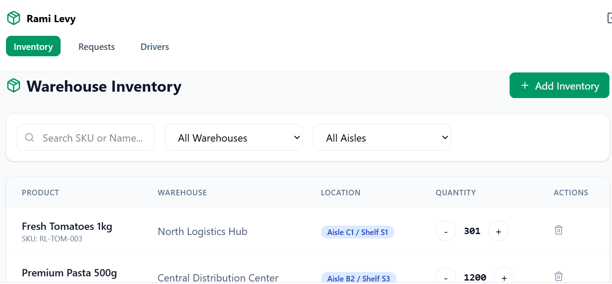
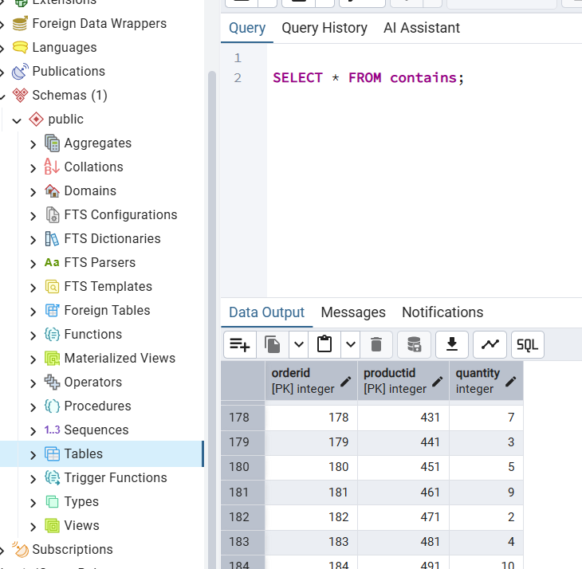

# Logistics & Inventory Management System (Rami Levy)

Project by **Sara Heymann 2254681 and Sarah Sebaoun 345887582**

## Table of Contents
- [Phase 1: Design and Build the Database](#phase-1-design-and-build-the-database)
  - [Introduction](#introduction)
  - [ERD (Entity-Relationship Diagram)](#erd-entity-relationship-diagram)
  - [DSD (Data Structure Diagram)](#dsd-data-structure-diagram)
  - [SQL Scripts](#sql-scripts)
  - [Data Population Methods](#data-population-methods)
  - [Backup & Restore](#backup--restore)
- [Phase 2: Queries and Constraints](#phase-2-queries-and-constraints)
  - [Introduction](#phase-2-introduction)
  - [1. SELECT Queries](#1-select-queries)
  - [2. COMMIT & ROLLBACK](#2-commit--rollback)
  - [3. UPDATE Queries](#3-update-queries)
  - [4. DELETE Queries](#4-delete-queries)
  - [5. Constraints (ALTER TABLE)](#5-constraints-alter-table)
  - [6. Indexes](#6-indexes)
  - [7. Backup](#7-backup-1)
- [Phase 3: System Integration](#phase-3-system-integration)
  - [Introduction](#phase-3-introduction)
  - [Step 1 - Reverse Engineering: from SQL to ERD](#step-1---reverse-engineering-from-sql-to-erd)
  - [Step 2 - DSD of the Received Department](#step-2---dsd-of-the-received-department)
  - [Step 3 - The Two ERDs](#step-3---the-two-erds)
  - [Step 4 - Integrated ERD & Design Decisions](#step-4---integrated-erd--design-decisions)
  - [Step 5 - DSD After Integration](#step-5---dsd-after-integration)
  - [Step 6 - Schema Changes (Integrate.sql)](#step-6---schema-changes-integratesql)
  - [Step 7 - Data Verification](#step-7---data-verification)
  - [Step 8 - Backup (backup3)](#step-8---backup-backup3)
  - [Views](#views)

---

## Phase 1: Design and Build the Database

### Introduction
The **Logistics Management System** is designed to efficiently manage the complex supply chain of a retail giant like **Rami Levy**. It tracks the journey of products from large-scale warehouses to individual store shelves through a coordinated transportation network.

#### Purpose of the System
- **Inventory Tracking**: Real-time monitoring of stock across different warehouse locations.
- **Store Orders**: Handling automated and manual product requests from stores.
- **Logistics & Fleet**: Managing trucks, driver schedules, and working hours.
- **Regional Distribution**: Connecting delivery companies to specific geographical sectors.

#### UI Prototypes (Google AI Studio)
*To visualize the system's interface, we generated various prototype pages using Google AI Studio:*

| Dashboard Overview | Inventory Management | Order Tracking | Delivery Schedule |
| :---: | :---: | :---: | :---: |
|  |  |  |  |

### ERD (Entity-Relationship Diagram)
The ERD illustrates the logical architecture of the database, showing how Stores, Warehouses, and Trucks interact.


### DSD (Data Structure Diagram)
The DSD details the physical schema, including primary/foreign keys and field constraints.


### SQL Scripts
- 📜 **[Create Tables](Stage%201/createTables.sql)**: Schema definition.
- 📜 **[Drop Tables](Stage%201/dropTables.sql)**: Table cleanup script.
- 📜 **[Select All](Stage%201/selectAll.sql)**: Data verification queries.

---

### Data Population Methods
We utilized three distinct strategies to populate the database with over 2,000 rows of realistic data:

#### 1. Manual CSV Import
Static reference data, such as warehouse locations and fixed regional codes, were imported via standard CSV files.
- 📂 **[Data Import Files](Stage%201/DataImportFiles/)**

#### 2. Automated Python Generation
For dynamic entities requiring specific logic (like unique store IDs or formatted phone numbers starting with "02"), we used Python scripts. This allowed for the generation of 300+ unique stores with professional naming conventions.
- 🐍 **Script:** `Stage 1/Programing/generator.py`

#### 3. Mockaroo (Synthetic Data)
To simulate a high volume of transactions and products, we used [Mockaroo](https://www.mockaroo.com/). This was essential for populating the `PRODUCT` and `CONTAINS` tables with valid dates and price ranges.


---

### Backup & Restore
Data safety is guaranteed through a complete SQL dump of the database.
- 💾 **[Database Backup File](databaseBackup.sql)**

We successfully performed a database restore to verify data persistence. The image below confirms the `contains` table was fully recovered in the pgAdmin environment:




---

## Phase 2: Queries and Constraints

### Phase 2 Introduction
In this phase, we query the database to extract meaningful insights and enforce business rules through constraints and indexes. 

All SQL query files for this phase can be found in the designated code directory: [Queries Folder](Stage%202/Queries/).

---

### 1. SELECT Queries

#### Double Versions (Comparing Efficiency: A vs B)

**Query 1: Products Below Minimum Stock**
- **Description:** Provide a global report of all products currently below their minimum stock threshold across all company warehouses.

**Version A (Multiple JOINs):** 
```sql
-- This scans all warehouses and links products to their current stock status.
SELECT 
    w.WarehouseID, 
    w.Region AS WarehouseName, 
    p.ProductName, 
    i.Quantity, 
    i.MinimumStock
FROM PRODUCT p
JOIN INVENTORY i ON p.ProductID = i.ProductID
JOIN LOCATED l ON p.ProductID = l.ProductID
JOIN WAREHOUSE w ON l.WarehouseID = w.WarehouseID
WHERE i.Quantity < i.MinimumStock
ORDER BY w.WarehouseID, p.ProductName; -- Organized by warehouse for clarity
```

**Version B (Subqueries):**
```sql
-- This calculates stock and warehouse names for each product individually.
SELECT 
    l.WarehouseID,
    (SELECT Region FROM WAREHOUSE WHERE WarehouseID = l.WarehouseID) AS WarehouseName,
    p.ProductName,
    (SELECT Quantity FROM INVENTORY WHERE ProductID = p.ProductID) AS Qty,
    (SELECT MinimumStock FROM INVENTORY WHERE ProductID = p.ProductID) AS MinStock
FROM PRODUCT p
JOIN LOCATED l ON p.ProductID = l.ProductID
WHERE p.ProductID IN (
      SELECT ProductID FROM INVENTORY WHERE Quantity < MinimumStock
)
ORDER BY l.WarehouseID;
```
**Comparison (Why Version A is better):** Version A uses standard JOINs to build a single result set, allowing the database engine to utilize indexes efficiently in one pass. Version B relies on multiple correlated subqueries in the SELECT clause, forcing a repetitive row-by-row lookup. This makes Version A significantly more efficient and the professional choice.

**Execution & Result:**  


**Query 2: Delivery Performance by Company**
- **Description:** Analyzes the delivery performance and financial volume handled by different delivery companies within the current month.

**Version A (Direct Grouping):**
```sql
-- Direct grouping after join
SELECT dc.DeliveryCieName, COUNT(o.OrderId) as TotalOrders, SUM(o.Price) as TotalValue
FROM DELIVERYCOMPAGNY dc
JOIN TRUCK t ON dc.DeliveryCieID = t.DeliveryCieID
JOIN "ORDER" o ON t.DriverID = o.DriverID
WHERE EXTRACT(MONTH FROM o.OrderDate) = EXTRACT(MONTH FROM CURRENT_DATE)
GROUP BY dc.DeliveryCieName;
```

**Version B (CTE):**
```sql
-- Breaking down steps for clarity
WITH MonthlyOrders AS (
    SELECT DriverID, OrderId, Price 
    FROM "ORDER" 
    WHERE EXTRACT(MONTH FROM OrderDate) = EXTRACT(MONTH FROM CURRENT_DATE)
)
SELECT dc.DeliveryCieName, COUNT(mo.OrderId), SUM(mo.Price)
FROM DELIVERYCOMPAGNY dc
JOIN TRUCK t ON dc.DeliveryCieID = t.DeliveryCieID
JOIN MonthlyOrders mo ON t.DriverID = mo.DriverID
GROUP BY dc.DeliveryCieName;
```
**Comparison (When to use which):** For this specific, straightforward aggregation, Version A is generally faster. Modern query optimizers handle simple JOIN and GROUP BY operations extremely well. However, Version B introduces a Common Table Expression (CTE). While slightly heavier here, this method becomes vastly more efficient if the logic defining `MonthlyOrders` needs to be reused multiple times within a much larger, complex script.

**Execution & Result:**  


**Query 3: Premium Stores Analysis**
- **Description:** Identifies high-rated stores (Rating >= 4) whose average order value exceeds the company-wide average to highlight top-performing locations.

**Version A (HAVING + Subquery):**
```sql
-- This is efficient because it groups data first and compares the aggregate.
SELECT 
    s.StoreID, 
    s.StoreName, 
    s.Rating, 
    ROUND(AVG(o.Price), 2) AS Store_Avg_Order
FROM STORE s
JOIN "ORDER" o ON s.StoreID = o.StoreID
WHERE s.Rating >= 4
GROUP BY s.StoreID, s.StoreName, s.Rating
HAVING AVG(o.Price) > (SELECT AVG(Price) FROM "ORDER") -- Comparing vs Global Average
ORDER BY Store_Avg_Order DESC;
```

**Version B (Correlated Subqueries):**
```sql
-- More complex structure but less efficient due to repeated executions.
SELECT 
    s.StoreName, 
    s.Rating,
    (SELECT ROUND(AVG(Price), 2) FROM "ORDER" WHERE StoreID = s.StoreID) AS Avg_Order
FROM STORE s
WHERE s.Rating >= 4 
AND (SELECT AVG(Price) FROM "ORDER" WHERE StoreID = s.StoreID) > 
    (SELECT AVG(Price) FROM "ORDER"); -- Nested comparison
```
**Comparison (Why Version A is better):** Version A is vastly superior in performance. It groups the data first and calculates the company-wide average exactly once. Version B utilizes highly inefficient correlated subqueries, forcing the database to recalculate the average order value for every single store multiple times. 

**Execution & Result:**  


**Query 4: Expiring Products Breakdown (2026)**
- **Description:** Decomposes the expiration date into separate year, month, and day fields for products expiring in 2026, comparing two filtering methods to demonstrate SQL performance optimization.

**Version A (Non-SARGable):**
```sql
/* Version A: Extracting parts individually for the SELECT 
   and using EXTRACT in the WHERE clause (Less efficient). */
SELECT 
    p.ProductName, 
    w.Region,
    EXTRACT(YEAR FROM p.ExpirationDate) as ExpYear,
    EXTRACT(MONTH FROM p.ExpirationDate) as ExpMonth,
    EXTRACT(DAY FROM p.ExpirationDate) as ExpDay,
    p.ExpirationDate -- Kept for visual reference
FROM PRODUCT p
JOIN LOCATED l ON p.ProductID = l.ProductID
JOIN WAREHOUSE w ON l.WarehouseID = w.WarehouseID
WHERE EXTRACT(YEAR FROM p.ExpirationDate) = 2026
ORDER BY ExpMonth ASC, ExpDay ASC;
```

**Version B (SARGable):**
```sql
/* Version B: Using a Subquery to filter 2026 products efficiently 
   using a SARGable range before joining other tables. */
SELECT 
    p_sub.ProductName, 
    w.Region,
    EXTRACT(YEAR FROM p_sub.ExpirationDate) as ExpYear,
    EXTRACT(MONTH FROM p_sub.ExpirationDate) as ExpMonth,
    EXTRACT(DAY FROM p_sub.ExpirationDate) as ExpDay,
    p_sub.ExpirationDate
FROM (
    -- Subquery: Filter products by date range first
    SELECT ProductID, ProductName, ExpirationDate
    FROM PRODUCT
    WHERE ExpirationDate BETWEEN '2026-01-01' AND '2026-12-31'
) AS p_sub
JOIN LOCATED l ON p_sub.ProductID = l.ProductID
JOIN WAREHOUSE w ON l.WarehouseID = w.WarehouseID
ORDER BY p_sub.ExpirationDate;
```

**Comparison (Why Version B is better):**  Version B is the optimized approach for production environments, ensuring fast response times even as the PRODUCT and ORDER tables grow to thousands of rows.

**Execution & Result:**  


#### Single Versions (Complex Queries)

**Query 5: Full Order Breakdown**
- **Description:** Retrieves all products within a specific order (3) with detailed attributes (including Kashrut certification and line total).
```sql
SELECT 
    (SELECT o.OrderId FROM "ORDER" o WHERE o.OrderId = c.OrderId) AS OrderId,
    (SELECT p.ProductName FROM PRODUCT p WHERE p.ProductID = c.ProductID) AS ProductName,
    (SELECT pk.Kashrut FROM PRODUCT_KASHRUT pk WHERE pk.ProductID = c.ProductID) AS Kashrut,
    c.Quantity,
    (c.Quantity * (SELECT p.Price FROM PRODUCT p WHERE p.ProductID = c.ProductID)) AS LineTotal
FROM 
    CONTAINS c
WHERE 
    c.OrderId = 3
ORDER BY 
    ProductName;
```
**Execution & Result:**  


**Query 6: Driver Workload Summary**
- **Description:** Summarizes the delivery performance of each driver by displaying their name, company, and total count of successfully completed orders.
```sql
SELECT t.DriverID, dc.DeliveryCieName, COUNT(o.OrderId) as DeliveredCount
FROM TRUCK t
JOIN DELIVERYCOMPAGNY dc ON t.DeliveryCieID = dc.DeliveryCieID
LEFT JOIN "ORDER" o ON t.DriverID = o.DriverID
WHERE o.DeliveryDate IS NOT NULL
GROUP BY t.DriverID, dc.DeliveryCieName
HAVING COUNT(o.OrderId) > 0;
```
**Execution & Result:**  


**Query 7: Available Drivers by Current Capacity**
- **Description:** Counts how many active orders (DeliveryDate is NULL) each driver currently has and compares it to their truck's capacity to find remaining slots.
```sql
/* We count how many active orders (DeliveryDate is NULL) 
   each driver currently has and compare it to their truck's capacity. */
SELECT 
    t.DriverID, 
    dc.DeliveryCieName, 
    t.Capacity AS Max_Capacity,
    COUNT(o.OrderId) AS Current_Active_Orders,
    (t.Capacity - COUNT(o.OrderId)) AS Remaining_Slots
FROM TRUCK t
JOIN DELIVERYCOMPAGNY dc ON t.DeliveryCieID = dc.DeliveryCieID
LEFT JOIN "ORDER" o ON t.DriverID = o.DriverID AND o.DeliveryDate IS NULL
WHERE t.Active = 1  -- Only active drivers
GROUP BY t.DriverID, dc.DeliveryCieName, t.Capacity
HAVING COUNT(o.OrderId) < t.Capacity  -- Only those who can still take orders
ORDER BY Remaining_Slots DESC;
```
**Execution & Result:**  


**Query 8: Regional Logistics & Profitability Analysis**
- **Description:** Uses a CTE to calculate regional stats and a subquery to link warehouses to products nearing expiration.
```sql
/* This query uses a CTE to calculate regional stats and a subquery to 
   link warehouses to products nearing expiration. */
WITH RegionalSales AS (
    SELECT 
        dcrs.RegionServed,
        dc.DeliveryCieName,
        SUM(o.Price) OVER(PARTITION BY dcrs.RegionServed) as TotalRegionalRevenue,
        COUNT(o.OrderId) OVER(PARTITION BY dcrs.RegionServed, dc.DeliveryCieID) as OrdersByCompany
    FROM DELIVERYCOMPAGNY dc
    JOIN DELIVERYCOMPAGNY_REGIONSERVED dcrs ON dc.DeliveryCieID = dcrs.DeliveryCieID
    JOIN TRUCK t ON dc.DeliveryCieID = t.DeliveryCieID
    JOIN "ORDER" o ON t.DriverID = o.DriverID
    WHERE o.OrderDate >= CURRENT_DATE - INTERVAL '6 months'
)
SELECT DISTINCT
    rs.RegionServed,
    rs.TotalRegionalRevenue,
    -- Identifies the top performing company in each region
    (SELECT dc2.DeliveryCieName 
     FROM RegionalSales rs2 
     JOIN DELIVERYCOMPAGNY dc2 ON rs2.DeliveryCieName = dc2.DeliveryCieName
     WHERE rs2.RegionServed = rs.RegionServed 
     ORDER BY rs2.OrdersByCompany DESC LIMIT 1) as Leading_Cie,
    -- Counts critical expiring products in the region's warehouses
    (SELECT COUNT(p.ProductID)
     FROM PRODUCT p
     JOIN LOCATED l ON p.ProductID = l.ProductID
     JOIN WAREHOUSE w ON l.WarehouseID = w.WarehouseID
     WHERE w.Region = rs.RegionServed 
     AND p.ExpirationDate BETWEEN CURRENT_DATE AND CURRENT_DATE + INTERVAL '30 days') as Critical_Exp_Count
FROM RegionalSales rs
ORDER BY rs.TotalRegionalRevenue DESC;
```
**Execution & Result:**  


---

### 2. COMMIT & ROLLBACK

#### ROLLBACK
```sql
BEGIN; -- Starts the transaction

-- 1. SHOW STATE BEFORE
-- Check drivers with more than 50 orders to see their current status
SELECT DriverID, MaintenanceStatus 
FROM TRUCK 
WHERE DriverID IN (SELECT DriverID FROM "ORDER" GROUP BY DriverID HAVING COUNT(*) > 50);
```


```sql
-- 2. EXECUTE MAINTENANCE UPDATE
-- Changes status to 'Required' for overloaded drivers
UPDATE TRUCK
SET MaintenanceStatus = 'Required'
WHERE DriverID IN (
    SELECT DriverID FROM "ORDER" 
    GROUP BY DriverID 
    HAVING COUNT(*) > 50
);

-- 3. SHOW STATE AFTER UPDATE BUT BEFORE ROLLBACK
-- You should now see 'Required' for these drivers
SELECT DriverID, MaintenanceStatus 
FROM TRUCK 
WHERE DriverID IN (SELECT DriverID FROM "ORDER" GROUP BY DriverID HAVING COUNT(*) > 50);
```


```sql
ROLLBACK; -- Undo all changes!

-- 4. SHOW THAT STATE RETURNED TO INITIAL VALUES
-- Statuses should be back to 'Good', 'Fair', etc.
SELECT DriverID, MaintenanceStatus 
FROM TRUCK 
WHERE DriverID IN (SELECT DriverID FROM "ORDER" GROUP BY DriverID HAVING COUNT(*) > 50);
```


#### COMMIT
```sql
BEGIN; -- Starts the transaction

-- 1. EXECUTE THE UPDATE
-- Set status to 'Required' based on order count
UPDATE TRUCK
SET MaintenanceStatus = 'Required'
WHERE DriverID IN (
    SELECT DriverID FROM "ORDER" 
    GROUP BY DriverID 
    HAVING COUNT(*) > 50
);

-- 2. SHOW MODIFIED STATE 
-- Confirm the change is visible within the current transaction
SELECT DriverID, MaintenanceStatus 
FROM TRUCK 
WHERE DriverID IN (SELECT DriverID FROM "ORDER" GROUP BY DriverID HAVING COUNT(*) > 50);

COMMIT; -- Permanently save the changes to the database

-- 3. SHOW STATE AFTER COMMIT 
-- Status remains 'Required' because the transaction was finalized
SELECT DriverID, MaintenanceStatus 
FROM TRUCK 
WHERE DriverID IN (SELECT DriverID FROM "ORDER" GROUP BY DriverID HAVING COUNT(*) > 50);
```


---

### 3. UPDATE Queries

**1. Restock Based on Minimum:**
**Description:** Adding 100 units to the inventory for all products that have fallen below their minimum stock threshold.
```sql
UPDATE INVENTORY
SET Quantity = Quantity + 100
WHERE Quantity < MinimumStock;
```
**Result (Before / Execution / After):**  
  
  


**2. Truck Maintenance Status:**
**Description:** Updating the maintenance status to 'Required' for drivers/trucks that have completed more than 50 orders.
```sql
UPDATE TRUCK
SET MaintenanceStatus = 'Required'
WHERE DriverID IN (
    SELECT DriverID 
    FROM "ORDER" 
    GROUP BY DriverID 
    HAVING COUNT(*) > 50
);
```
**Result (Before / Execution / After):**  
  
  


**3. Seasonal Discount:**
**Description:** Applying a 10% price reduction to products manufactured before 2024 to encourage sales.
```sql
UPDATE PRODUCT
SET Price = Price * 0.9
WHERE DateOfManufacture < '2024-01-01';
```
**Result (Before / Execution / After):**  
  
  


---

### 4. DELETE Queries

**1. Remove Old Empty Orders:**
**Description:** Deleting orders from previous years that do not contain any items (to clean up the system).
```sql
DELETE FROM "ORDER"
WHERE OrderDate < '2025-01-01'
AND OrderId NOT IN (SELECT OrderId FROM CONTAINS);
```
**Result (Execution / After):** 
  
  


**2. Remove an unused or specific Kashrut certification:**
**Description:** Removing a kashrut type that is no longer supported or needed.
```sql
DELETE FROM PRODUCT_KASHRUT 
WHERE Kashrut = 'OU';
```
**Result (Before & Execution / After):**  
  


**3. Remove Inactive Trucks with No Order History:**
**Description:** Deleting trucks/drivers that are marked as inactive and have never been assigned to any order to keep the fleet database clean.
```sql
DELETE FROM TRUCK
WHERE Active = 0 
AND DriverID NOT IN (SELECT DriverID FROM "ORDER");
```
**Result (Before / Execution / After):**  
  
  


---

### 5. Constraints (ALTER TABLE)

**🚨 Important Note:** A significant portion of our database constraints (Primary Keys, Foreign Keys, `NOT NULL`, and basic checks) were already thoroughly defined directly during the table creation phase. Because of this solid foundation, the new constraints added here via `ALTER TABLE` are specifically targeted at advanced business rules, keeping them simple and effective. You can view our extensive initial constraint setup in our original script: [createTables.sql](Stage%201/createTables.sql).

**1. URL Format Constraint:**
**Description:** Ensures the website URL always starts with 'http' to maintain data consistency.
```sql
ALTER TABLE STORE 
ADD CONSTRAINT check_url_format CHECK (WebSiteUrl LIKE 'http%');

-- Attempting to update a store with an invalid URL format (missing 'http')
-- This will trigger the 'check_url_format' constraint error.
UPDATE STORE 
SET WebSiteUrl = 'www.ramilevy.co.il' 
WHERE StoreID = 1;
```


**2. Logic Stock Constraint:**
**Description:** Prevents errors by ensuring MinimumStock never exceeds a logical maximum (e.g., 10,000).
```sql
ALTER TABLE INVENTORY 
ADD CONSTRAINT check_min_stock_limit CHECK (MinimumStock <= 10000);
```

**3. Contact Uniqueness Constraint:**
**Description:** Ensures that no two stores share the same phone number.
```sql
ALTER TABLE STORE 
ADD CONSTRAINT unique_store_phone UNIQUE (Phone);
```


---

### 6. Indexes

**INDEX 1: Optimizing Product Name searches (Textual search)**
**Description:** Useful for customer-facing search bars.
```sql
EXPLAIN ANALYZE SELECT * FROM PRODUCT WHERE ProductName = 'Coconut - Creamed, Pure';
```

```sql
CREATE INDEX idx_product_name ON PRODUCT(ProductName);

EXPLAIN ANALYZE SELECT * FROM PRODUCT WHERE ProductName = 'Coconut - Creamed, Pure';
```


**INDEX 2: Optimizing Expiration Date queries (Date filtering)**
**Description:** Specifically improves Query 4 performance regarding stock rotation.
```sql
EXPLAIN ANALYZE SELECT * FROM PRODUCT WHERE ExpirationDate BETWEEN '2026-01-01' AND '2026-12-31';

CREATE INDEX idx_expiration_date ON PRODUCT(ExpirationDate);

EXPLAIN ANALYZE SELECT * FROM PRODUCT WHERE ExpirationDate BETWEEN '2026-01-01' AND '2026-12-31';
```


**INDEX 3: Optimizing Order Price analysis (Numeric range)**
**Description:** Vital for financial reporting on the 1,000+ orders now in the database.
```sql
EXPLAIN ANALYZE SELECT * FROM "ORDER" WHERE Price > 400;

CREATE INDEX idx_order_price ON "ORDER"(Price);

EXPLAIN ANALYZE SELECT * FROM "ORDER" WHERE Price > 400;
```


---

### 7. Backup
An updated backup file encompassing all Phase 2 modifications (new table states, constraints, indexes, and test data) has been generated.

💾 **Phase 2 Database Backup File:** [Backup2](Stage%202/Backup2.sql)

---

## Phase 3: System Integration

### Phase 3 Introduction
In this phase we merge our Logistics system with the database of **another team**. Each team receives a backup of another team's project and must integrate the two databases into a **single unified database**.

We applied **Integration Method A** (the *merge* approach): the received database is not kept as a separate system — its structure and data are absorbed into our existing database using only `CREATE TABLE` and `ALTER TABLE` commands. **No existing table is ever recreated from scratch.**

The full integration workflow:
1. Receive the other team's `CREATE TABLE` script and database backup.
2. **Reverse-engineer** an **ERD** from their `CREATE TABLE` script, then draw the matching **DSD**.
3. Place the two ERDs (ours + theirs) side by side.
4. Design a single **integrated ERD**, documenting every design decision.
5. Derive the new schema from the integrated ERD and apply it with `ALTER`/`CREATE` only — see `Integrate.sql`.
6. Populate every table with data from **both** databases.
7. Re-run the Phase 2 queries on the integrated database to confirm they still work.

The received database is a **retail / orders system**: customers, product categories, suppliers, products, orders, order items, inventory and stores.

---

### Step 1 - Reverse Engineering: from SQL to ERD and DSD

We received two files from the other team: their **`createTables.sql`** script and a **database backup**. They serve two different purposes in our workflow:

- the **`createTables.sql`** script is the input read by our reverse-engineering algorithm to automatically rebuild their ERD and DSD — this is the step described below;
- the **database backup** (`backup2_01_25_26.sql`) is used only later, to restore their actual data into pgAdmin inside a separate `db2` schema (see Step 6).

The assignment requires a **reverse-engineering algorithm**: a documented procedure that takes the received system's tables and produces its conceptual and logical diagrams. We implemented this algorithm as a single Python program that generates **both images simultaneously**.

- 🐍 **Algorithm code:** [txt_to_graphviz.py](Stage%203/txt_to_graphviz.py)

#### How the algorithm works

The program reads the received `createTables.sql` file and rebuilds the diagrams step by step:

**1. Parse the SQL.** Comments are stripped, then a regular expression isolates every `CREATE TABLE name ( ... );` block.

**2. Extract the structure of each table.** For every table the algorithm collects:
- the **primary-key** columns (from a `PRIMARY KEY (...)` clause or an inline declaration);
- the **foreign-key** columns and the table each one references (from `FOREIGN KEY (...) REFERENCES ...`);
- the remaining **normal columns**.

**3. Apply the reverse-engineering rules** — the core logic that turns a physical schema back into conceptual rules:
- A foreign-key column that is **part of the primary key** creates an **identifying relationship** (the table becomes a **weak entity**).
- A column **without** `NOT NULL` becomes an **optional attribute**, marked `(O)`.
- A foreign-key column **not** in the primary key becomes a normal **N : 1 relationship**.
- A `PRIMARY KEY` column becomes a **key attribute** (underlined).

**4. Build the diagrams (DOT Language).** The script translates these rules into two separate Graphviz descriptions:
- **For the ERD:** Uses `neato` layout and Chen notation (rectangles for entities, ellipses for attributes, diamonds for relationships).
- **For the DSD:** Uses `dot` layout and generates HTML-like tables strictly mirroring the **ERDPlus** style (primary keys placed above a separator line, foreign keys tagged with `[FK]`, and orthogonal relationship arrows).

**5. Render the images.** The algorithm sends both DOT codes to a public Graphviz API (`quickchart.io/graphviz`), which automatically downloads and saves the final PNG images directly into our project folder.

#### Result — ERD of the received department

Running the script automatically produced `erd_schema.png`:


---

### Step 2 - DSD of the Received Department

Thanks to our Python script, the **DSD (Relational Schema)** of the received department (their 8 tables: `customer`, `category`, `supplier`, `product`, `orders`, `orderitem`, `inventory`, `store`) was generated automatically alongside the ERD, perfectly formatted for our report:


---

### Step 3 - The Two ERDs

At this point we hold **two** ERDs:

- **Our original ERD** — the Logistics system (warehouses, trucks, delivery companies, stores, orders), shown earlier in [Phase 1](#erd-entity-relationship-diagram).
- **The received ERD** — the retail/orders system reconstructed in Step 2 (`erd_new.png`).

These two diagrams are the input for the design-level integration of the next step.

---

### Step 4 - Integrated ERD & Design Decisions

We merged the two ERDs into a single **integrated ERD** using ERDPlus:


Designing the combined model required several decisions, documented here:

- **New entities adopted from the received system:** `CUSTOMER`, `CATEGORY` and `SUPPLIER` are added as new tables.
- **`PRODUCT` gains two links:** a mandatory link to `CATEGORY` and an **optional** link to `SUPPLIER`. The link to a supplier is optional on purpose — products from our original system have no supplier, so not every product is required to have one.
- **`ORDER` can now belong to a Store *or* a Customer:** the received system attaches orders to customers, while our system attaches them to stores and drivers. In the integrated model `StoreID`, `DriverID` and the new `CustomerID` all become optional, and a rule guarantees that every order is linked to **at least one** of the two sides.
- **`ORDER` gains `PaymentMethod` and `Status`** from the received system.
- **`CONTAINS` absorbs the received `orderitem`:** it gains `SubTotal`, `InOnSale` and `SaleDescription`.
- **`INVENTORY` gains a link to `STORE`:** the received inventory is tracked per store, so an inventory row is now attached to a store.
- **`WAREHOUSE_WAREHOUSEMANAGER` is kept**, alongside the new `SUPPLIER` table.
- **`INVENTORY` stays a regular entity:** although it could be drawn as a weak entity, both source schemas define its primary key as `ProductID` alone, so it is kept as a regular entity in the final model.

---

### Step 5 - DSD After Integration

From the integrated ERD we derived the **DSD of the integrated database**:


This DSD is the physical blueprint that `Integrate.sql` builds — but, crucially, it is built by **altering the existing tables**, never by dropping and recreating them.

---

### Step 6 - Schema Changes (Integrate.sql)

All structural and data changes are applied by a single script, executed once inside one transaction (`BEGIN ... COMMIT`) so that any failure rolls everything back.

- 📜 **Integration script:** [Integrate.sql](Stage%203/Integrate.sql)

#### Preparing the data source

The received backup was a UTF-16 dump that used `COPY ... FROM stdin`, which the pgAdmin Query Tool cannot run. We converted it to a UTF-8 file using standard `INSERT` statements, and restored it into a **separate schema named `db2`** inside the same database. Our original tables stay in the `public` schema. `Integrate.sql` then reads the received data from `db2` and writes it into `public`.

#### What Integrate.sql takes into account

**ID offset.** Both databases use their own `ProductID`, `OrderId` and `StoreID` values, so the same number can exist in both. Every received id is shifted by **+10000** before insertion, and the same offset is reused everywhere a shifted id appears (inventory, order items), so all links stay consistent.

**Part 1 - New tables.** `CATEGORY`, `CUSTOMER` and `SUPPLIER` are created.

**Part 2 - Altering existing tables.** New columns are added (`PRODUCT.CategoryID`, `PRODUCT.SupplierID`, `ORDER.PaymentMethod`, `ORDER.Status`, `ORDER.CustomerID`, `CONTAINS.SubTotal`, `CONTAINS.InOnSale`, `CONTAINS.SaleDescription`, `INVENTORY.StoreID`). They are added as nullable first, since existing rows have no value yet. `ORDER.StoreID` and `ORDER.DriverID` lose their `NOT NULL` so an order may instead belong to a customer.

**Part 3 - Filling our existing rows.** Existing products receive a default `'no category'`; existing orders receive `PaymentMethod = 'Cash'`; existing `CONTAINS` rows get a computed `SubTotal` (`Quantity × Price`) and `InOnSale = FALSE`; existing inventory rows are attached to one of our stores.

**Part 4 - Importing the received data.** Categories, suppliers and customers are copied directly. Products, orders, inventory and order items are imported with the +10000 offset. The received `orderitem` is merged into `CONTAINS`, summing quantities of duplicated (order, product) lines.

**Data-quality handling — constraints are kept, invalid rows are skipped.** Rather than weakening any constraint, rows that would violate one are filtered out: received products whose `ExpirationDate` is earlier than `DateOfManufacture` are skipped (with their dependent inventory and order lines), received stores with a duplicate phone number are skipped, and store ratings are clamped into the valid 1–5 range.

**`INVENTORY` and stores.** Every inventory row — ours and the imported ones — is attached to an existing store using a round-robin distribution, so the `StoreID` link is always valid.

**Part 5 - Locking the schema.** Once data is in place, columns are made `NOT NULL` where the data allows it, and the new foreign keys (`fk_product_category`, `fk_product_supplier`, `fk_order_customer`, `fk_inventory_store`) and the order-ownership check are added.

---

### Step 7 - Data Verification

After running `Integrate.sql`, every table holds data from **both** original databases. The screenshots below show the database state **before** and **after** the integration:

| Before Integration | After Integration |
| :---: | :---: |
|  |  |

We also re-executed the **Phase 2 queries** on the integrated database to confirm that the schema changes did not break any existing query — they all still run correctly on the unified data.

---

### Step 8 - Backup (backup3)

A complete, updated SQL dump of the **integrated database** was generated. It captures the final unified schema together with the merged data from both teams, and guarantees that the integrated system can be fully restored.

- 💾 **Integrated Database Backup:** [backup3.sql](Stage%203/backup3.sql)

---

### Views

As required, we wrote **two views** — one from the perspective of each original department — plus **two queries per view**. Both views combine two tables with a `JOIN`, and neither is a plain field extraction.

- 📜 **Views script:** [Views.sql](Stage%203/Views.sql)

#### View 1 — `company_fleet_summary` *(our original department)*

**Description:** For each delivery company, this view summarises its truck fleet — total number of trucks, number of active trucks, and total / average hauling capacity. It **joins** `DELIVERYCOMPAGNY` with `TRUCK` and groups the result per company.

```sql
CREATE VIEW company_fleet_summary AS
SELECT d.DeliveryCieID,
       d.DeliveryCieName,
       COUNT(t.DriverID)                             AS total_trucks,
       SUM(CASE WHEN t.Active = 1 THEN 1 ELSE 0 END) AS active_trucks,
       SUM(t.Capacity)                               AS total_capacity,
       ROUND(AVG(t.Capacity), 2)                     AS avg_capacity
FROM DELIVERYCOMPAGNY d
JOIN TRUCK t ON t.DeliveryCieID = d.DeliveryCieID
GROUP BY d.DeliveryCieID, d.DeliveryCieName;
```

**Data from the view (`SELECT * FROM company_fleet_summary`):**


**Query 1.1 — Largest fleets.** Delivery companies that operate at least 3 trucks, ordered by the largest total hauling capacity first.
```sql
SELECT *
FROM company_fleet_summary
WHERE total_trucks >= 3
ORDER BY total_capacity DESC;
```


**Query 1.2 — Fleet size vs. coverage.** Compares each company's fleet size with the number of regions it serves, using the additional table `DELIVERYCOMPAGNY_REGIONSERVED`.
```sql
SELECT f.DeliveryCieName,
       f.total_trucks,
       f.active_trucks,
       COUNT(r.RegionServed) AS regions_covered
FROM company_fleet_summary f
JOIN DELIVERYCOMPAGNY_REGIONSERVED r
  ON r.DeliveryCieID = f.DeliveryCieID
GROUP BY f.DeliveryCieName, f.total_trucks, f.active_trucks
ORDER BY regions_covered DESC;
```


#### View 2 — `customer_order_summary` *(the received department)*

**Description:** For each customer, this view summarises their ordering activity — number of orders placed, total amount spent, and average order value. It **joins** `CUSTOMER` (a received table) with `ORDER` using a `LEFT JOIN`, so that customers who never ordered still appear with zero values.

```sql
CREATE VIEW customer_order_summary AS
SELECT c.CustomerID,
       c.CustomerName,
       c.City,
       COUNT(o.OrderId)                    AS total_orders,
       COALESCE(SUM(o.Price), 0)           AS total_spent,
       COALESCE(ROUND(AVG(o.Price), 2), 0) AS avg_order_value
FROM CUSTOMER c
LEFT JOIN "ORDER" o ON o.CustomerID = c.CustomerID
GROUP BY c.CustomerID, c.CustomerName, c.City;
```

**Data from the view (`SELECT * FROM customer_order_summary`):**


**Query 2.1 — Top customers.** The ten customers who spent the most money overall (only customers who placed at least one order).
```sql
SELECT *
FROM customer_order_summary
WHERE total_orders > 0
ORDER BY total_spent DESC
LIMIT 10;
```


**Query 2.2 — Revenue per city.** Total amount spent by all customers of each city, with how many customers contribute to it, ranked from the highest revenue to the lowest.
```sql
SELECT City,
       COUNT(*)         AS customers_in_city,
       SUM(total_spent) AS city_revenue
FROM customer_order_summary
GROUP BY City
ORDER BY city_revenue DESC;
```

