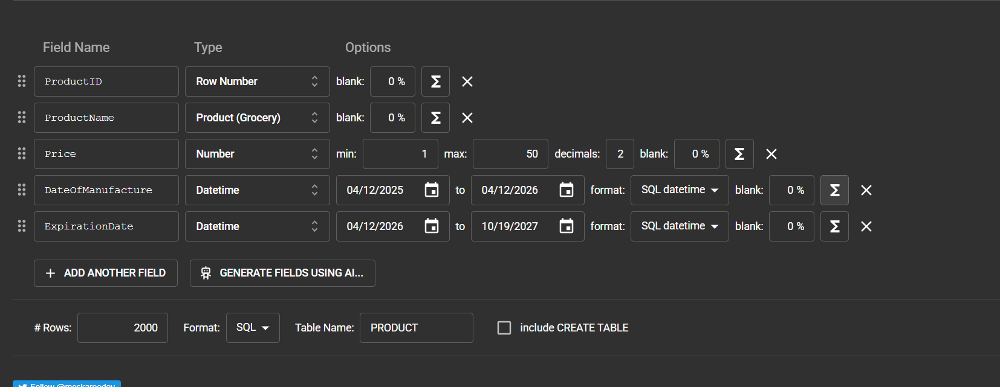

# Logistics & Inventory Management System (Rami Levy)

Project by **Sara Heymann 2254681 and Sarah Sebaoun 345887582**

## Table of Contents
- [Phase 1: Design and Build the Database](#phase-1-design-and-build-the-database)
  - [Introduction](#introduction)
  - [ERD (Entity-Relationship Diagram)](#erd-entity-relationship-diagram)
  - [DSD (Data Structure Diagram)](#dsd-data-structure-diagram)
  - [SQL Scripts](#sql-scripts)
  - [Data Population Methods](#data-population-methods)
  - [Backup & Restore](#backup--restore)
- [Phase 2: Integration](#phase-2-integration)

---

## Phase 1: Design and Build the Database

### Introduction
The **Logistics Management System** is designed to efficiently manage the complex supply chain of a retail giant like **Rami Levy**. It tracks the journey of products from large-scale warehouses to individual store shelves through a coordinated transportation network.

#### Purpose of the System
- **Inventory Tracking**: Real-time monitoring of stock across different warehouse locations.
- **Store Orders**: Handling automated and manual product requests from stores.
- **Logistics & Fleet**: Managing trucks, driver schedules, and working hours.
- **Regional Distribution**: Connecting delivery companies to specific geographical sectors.

#### UI Prototypes (Google AI Studio)
*To visualize the system's interface, we generated various prototype pages using Google AI Studio:*

| Dashboard Overview | Inventory Management | Order Tracking | Delivery Schedule |
| :---: | :---: | :---: | :---: |
|  |  |  |  |

### ERD (Entity-Relationship Diagram)
The ERD illustrates the logical architecture of the database, showing how Stores, Warehouses, and Trucks interact.

### DSD (Data Structure Diagram)
The DSD details the physical schema, including primary/foreign keys and field constraints.

### SQL Scripts
- 📜 **[Create Tables](Stage%201/createTables.sql)**: Schema definition.
- 📜 **[Drop Tables](Stage%201/dropTables.sql)**: Table cleanup script.
- 📜 **[Select All](Stage%201/selectAll.sql)**: Data verification queries.

---

### Data Population Methods
We utilized three distinct strategies to populate the database with over 2,000 rows of realistic data:

#### 1. Manual CSV Import
Static reference data, such as warehouse locations and fixed regional codes, were imported via standard CSV files.
- 📂 **[Data Import Files](Stage%201/DataImportFiles/)**

#### 2. Automated Python Generation
For dynamic entities requiring specific logic (like unique store IDs or formatted phone numbers starting with "02"), we used Python scripts. This allowed for the generation of 300+ unique stores with professional naming conventions.
- 🐍 **Script:** `Stage 1/Programing/generator.py`

#### 3. Mockaroo (Synthetic Data)
To simulate a high volume of transactions and products, we used [Mockaroo](https://www.mockaroo.com/). This was essential for populating the `PRODUCT` and `CONTAINS` tables with valid dates and price ranges.

---

### Backup & Restore
Data safety is guaranteed through a complete SQL dump of the database.
- 💾 **[Database Backup File](databaseBackup.sql)**

We successfully performed a database restore to verify data persistence. The image below confirms the `contains` table was fully recovered in the pgAdmin environment:

---

## Phase 2: Integration
This phase focuses on the Python/PostgreSQL bridge using **SQLAlchemy**, enabling the application to perform automated inventory updates and generate logistics reports directly from the database.
